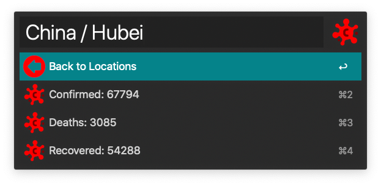

# COVID-19 Radar

A workflow for [Alfred 4][1].

## Download and Installation

Download the workflow file from [GitHub releases][2] and install it by double-clicking on `COVID-19.Radar.alfredworklow`.

## Usage

**Urban Dictionary** workflow can be used by the `cr` keyword.

## Credits

This workflow relies on [Alfred-Workflow][3] library by Dean Jackson.

## License

**COVID-19 Radar** workflow code is released under the [MIT License][4].

[1]:http://www.alfredapp.com/
[2]:https://github.com/xilopaint/alfred-covid-19-radar/releases/latest
[3]:https://github.com/deanishe/alfred-workflow
[4]:https://opensource.org/licenses/MIT
